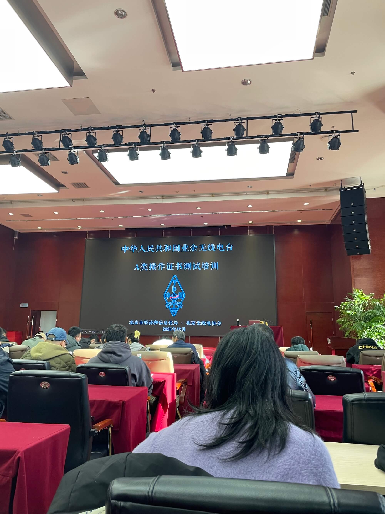
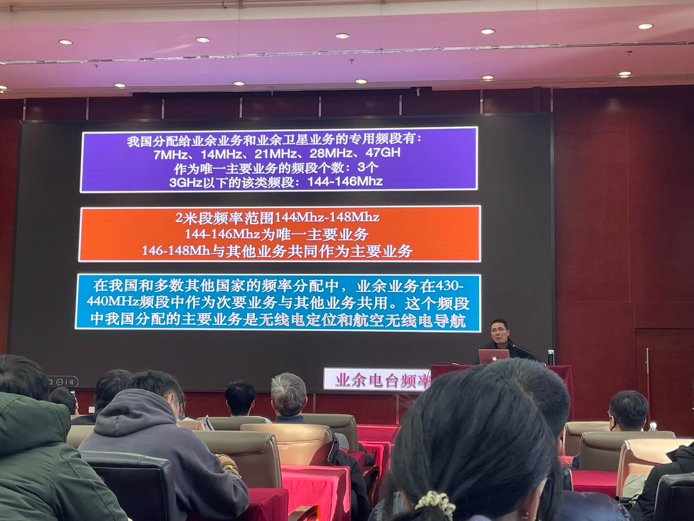
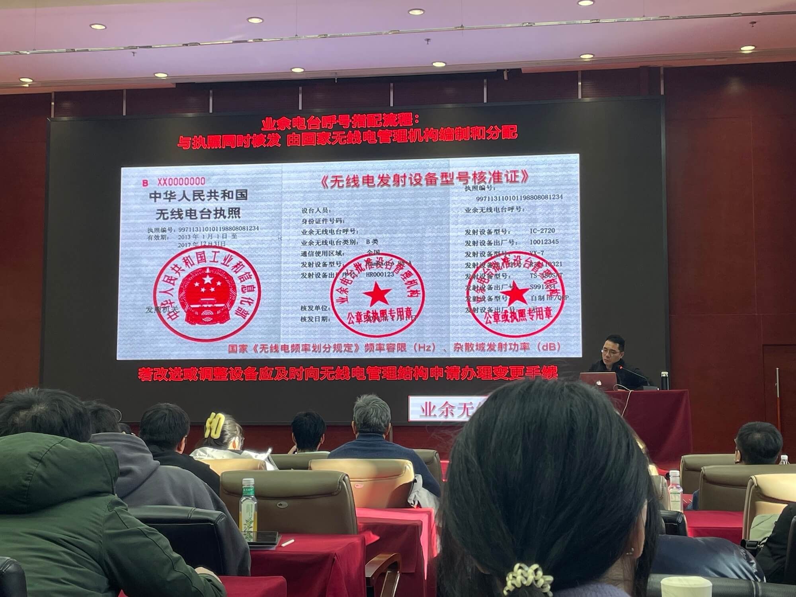
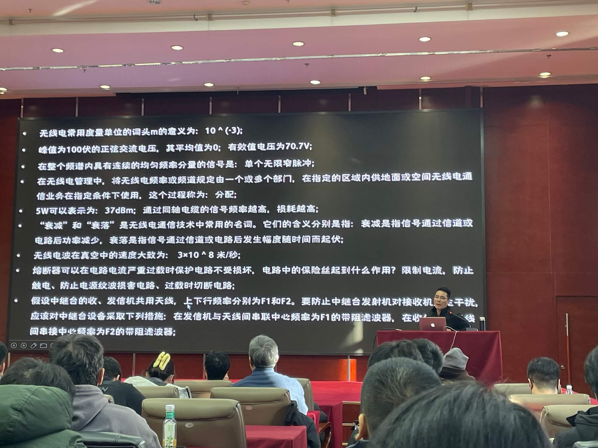

最近接触了无线电，决定申请 A 类业余无线电操作证书。

<!-- truncate -->

11 月底，同事邀请我一起报名 A 类业余无线电考试。整个流程包括拍照、申请、审核等环节，时间相对较长。其中，拍照环节要求提供近半年内的 1 寸白底照片，如果没有符合要求的就需要重新拍摄。我将整个经历写下来分享给大家，本文按照时间顺序记录，建议阅读全文及相关后续文章，因为有些内容可能会在后续文章中提及，以免错过关键信息。

## 玩无线电流程

考取操作证书（相当于考驾驶本）-> 购买设备（相当于买车） -> 设备备案登记（相当于办理车辆行驶证），同时获得个人呼号（相当于车牌号）

## 考证准备

我在北京，这里的考试场次相对较多。通过关注相关微信公众号，可以找到对应的报名注册网页。

首先需要通过身份审核，提交一寸照片、个人身份证、地址等信息即可，无需付费。据其他考生介绍，审核过程通常需要近一周时间，我周六提交的申请，周三就通过了审核。

另外，北京的报名网页会询问是否加入 A 类会员，提供学习辅导服务，费用为 100 元。这项服务包括考试前 90 分钟的现场培训，由老师讲解重点内容。是否选择这项服务因人而异，我会在后文详细说明其效果。

接下来就是申请 A 类业余无线电操作证书考试报名。首次报名只能选择 A 类，直接选择合适的考试时间段即可，报名同样免费。

> **重要提示**：考试报名不需要付费，这个知识点在考试中确实会出现，是一道真实的考题。

## 考证复习

我预约的是 12 月 20 日下午 13 点的考试场次，大约提前两周半开始准备学习。

### 第一周（周五至周日三天）+ 第二周

这段时间主要是熟悉和学习 680 多道题目，并抽空进行顺序测验，完成一轮完整测试后，对错题进行反复研究。这样能确保对所有题目都有基本印象。

准确地说，除了第二周周末外，其他时间大多用于了解题目内容，周末才开始进行大规模的顺序测验。

我推荐使用微信小程序「HAM 模拟考试」，这个应用学习体验好，支持错题追踪功能，还能看到其他学员的解答或者巧记方法。

做练习时不要怕出错，甚至我认为多遇到一些错题反而更好，这样可以看到其他学员的解答思路。在正常情况下，只能查看标准答案讲解。

需要注意的是，一定要学习 680 多道题的版本，有些网站或题库可能还在使用 370 题的旧版本。旧版本是 2025 年 10 月之前的考试范围。

由于每个人的学习能力不同，我就不具体讲解某道题目了。建议有能力的考生可以稍微理解一下原理和解题思路，特别是简单的加减运算题，这样理解一次后，所有同类型题目都能迎刃而解。但没必要纠结于复杂的计算题，这类题目还是直接记忆答案更高效。

### 第三周（考试前五天）及周六考试

最后一周主要是进行模拟考试练习。正式考试是随机抽取 40 道题目，答对 30 题算合格，其中包含 8 道多选题。多选题必须完全匹配所有正确答案，否则整题算错。

除了前面提到的「HAM 模拟考试」外，我还使用过「业余无线电」小程序，这个应用主要提供单纯的出题、做题和评分功能，没有讲解环节。但我认为有必要使用它进行练习，因为两个应用的出题思路差异较大：「HAM 模拟考试」更倾向于数字计算类题目，而「业余无线电」则更侧重于文字法规类题目。另外，「HAM 模拟考试」采用随机顺序出题，与真实考试形式一致，而「业余无线电」则是单选题在前、多选题在后。

周一到周四，我每天进行约 2-3 次模拟测试，成绩平均 32 分，最低 30 分，最高 34 分。周五增加到 6-7 次模拟测试，平均成绩提高到约 35 分。

从开始模拟练习到正式考试，我总共进行了不到 20 次模拟测试，通过率达到 100%。

周五晚上，我失眠了，满脑子都是题目和答案...

## 参加考试

考试当天，周六，我先在家做了一轮模拟测试，然后前往考场。北京这里考试需要提前准备好身份证和考试用笔，具体要求请参考各地区的考试通知。

下午一点开始进行考前培训，时长 90 分钟，之后短暂休息后开始正式考试，考试时长 40 分钟。在培训过程中，我又完成了一次模拟测试。需要注意的是，中途离开考场时需交出身份证，换取考试证，回来后再换回身份证，这种管理方式有效防止了代考情况的发生。

我提前 5 分钟左右到达考场，会议大厅已经人满为患，两人一桌，大约坐满了 70%。

考前培训主要讲解无线电基础知识、相关历史等内容，非常有趣，让我对无线电有了初步认识。不过对于提高考试成绩帮助有限，主要是因为老师不会讲解具体考题，最多只是提及大概的知识方向和内容范围。

因为我复习比较充分，所以听培训内容时感觉轻松有趣，可以算是对知识系统的锦上添花，但对提高考试成绩帮助有限。

如果你不复习或复习很少，只依靠考前培训，我估计通过率不到 50%。如果既不复习也不参加培训，直接裸考的通过率应该非常低。

当然，考试失利也不必太灰心。我离开时，一起下楼的人中有许多都是第二次来参加考试的。看来整体通过率确实不会太高。未能通过考试确实是因为题目有一定难度。

我认为更合理的学习顺序应该是先参加培训，再自行复习，最后参加考试。如果有专业老师指导，我估计最快用一周五天时间复习，周六参加考试就能顺利通过。

关于考试内容，北京地区使用 8 套不同的试卷，防止抄袭。据说之前只有 3 套题，考生之间稍微交流一下问题不大。现在题目完全随机，没有固定规律，但可以确定的是，不会全是法律法规类题目或某一类型题目反复出现，各类型题目分布较为平均。

在纸质试卷上看题不如在手机或 iPad 上清晰方便，特别是单选题和多选题的区分，一定要看清楚，我就有一题开始看成了单选，后来才发现是多选题。而且题目也是随机排序，单选题和多选题混合在一起出现。

北京地区采用简易答题卡形式，试卷最后一页就是答题卡，考生可以用任意笔将选择的选项涂黑即可。据说有些地区是采用计算机考试或手机下载 APP 答题的形式。

考场管理相对宽松，但绝不意味着可以作弊。考场内有 5 名监考官随机走动监督。如果考生桌面不整洁，例如放置有练习册等资料，监考官会提醒收起。

考试结束后，自己收拾好个人物品，到考场门口交卷即可。

## 考试结果和时间细节

12 月 20 日周六参加考试，包含三场，共计 400 人左右。

12 月 26 日（次周周五）微信公众号通知通过，但是名单中只有 187 人。

随后 12 月 30 日（再次周周二），在 [业余无线电台操作技术能力验证及信息管理系统](http://82.157.138.16:8091/CRAC/crac/pages/list_cert.html) 可以查到自己的证书编号了。随后与北京业余无线电协会考试方联系，他们说是有一批操作证，但是节前处理不完了。

12 月 31 日，我当天晚上我在无线电协会申请了设备登记，1 月 5 日显示审核通过。后续不确定是否需要无线电机构再次审核。

1 月 4 日，微信公众号通知可以领取操作证了，此时允许领取人数是 323 人，我也解释不了为何不是之前的 187 人。我当天申请了邮寄。

1 月 5 日晚些时候操作证发快递了。

1 月 6 日收到操作证，快递到付。

## 总结

考取 A 类业余无线电操作证是一个系统性的过程，建议还是充分准备下，否则通过率不会太高。单纯为了考证意义不大，这个证也不值钱。

最后祝各位通过，73。

对了，获得操作证书后，下一步就是购买设备和进行设备备案登记，最终获得个人呼号。目前我也只是买了设备(泉盛 UVK6)熟悉中，等我后续持续更新文章。
