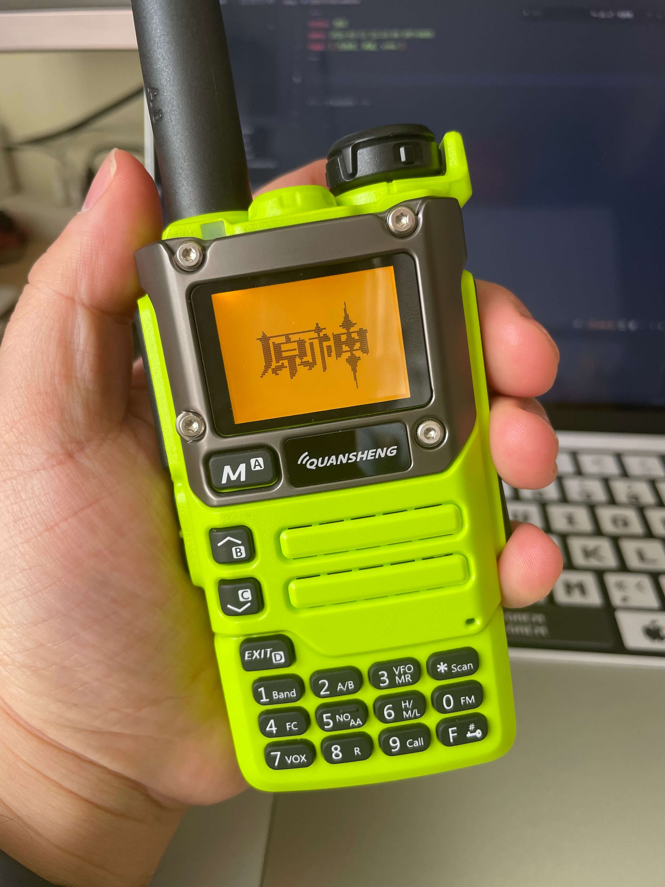
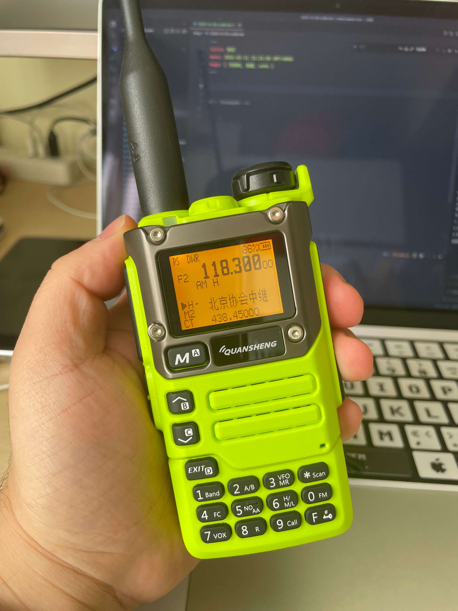

去年 12 月考试时候收到了泉盛 UV-K6 手台，偶尔玩一下而已，说说自己的心得。

<!-- truncate -->

泉盛 UV-K6 有新版的，是 512KB 大内存版（也叫作 4Mbit），可以自己直刷 losehu（罗师虎）固件。我买的是新款，大概 160 块。老版本可以便宜 10 块左右。如果你需要刷固件，还需要购买一根“K头”线，我直接在店家这里买了，29.9 有点贵。主要是懒得去别的店铺再找了，这根线也不复杂，有“K头”的话，可以用 USB 口自己做一个。





到手之后是默认官方固件，我大概完了半天，就刷成 losehu 了，都说 losehu 固件可玩性强，不过接收灵敏度比官方稍微差一点点，好像是加了中文字库导致的。

## 刷 losehu 固件 / 配置

可以到这里查看固件源码 [Github - uv-k5-firmware-custom](https://github.com/losehu/uv-k5-firmware-custom)，不过不用这么复杂，可以网页直接搞定。

[国内访问 k5.vicicode.cn](https://k5.vicicode.cn) / [国外访问 k5.vicicode.com](https://k5.vicicode.com)

1. 首先确保手台有电，使用 “K头”链接手台和电脑。其中手台侧，一定要用力，插入手台最里面。我已开始就是查了一半，以为插到头了；
2. 手台开机，网页端，右上角找到“连接”，并选择 USB 设备即可；
3. 【写频 - 基础信息】栏目，可以看到连接成功字样，并可以看到详情。我的刷机过了，不刷机部分信息不能显示（或者显示错误）；
```
手台信息
当前固件版本：LOSEHU132H
匹配写频配置：LoseHu 124+ 2Mbit 扩容版
存储大小：512KB（4Mbit） 
```
4. 【小工具 - 备份/还原】栏目，可以进行完整的备份，当然也可以不备份。出问题的话，UV-K6官方固件可以在[这里](https://qsfj.com/products/3268)找到；
5. 【创意工坊 - 固件市场】栏目，找到需要的固件，我搜索 “losehu”，选择了 LOSEHU132H 固件，直接点击最右侧的“使用”。这样可以不用下载固件了；
6. 页面经过第五步操作，会自动跳转到【小工具 - 固件升级】栏目，此时注意右侧的“Official/K1/UVE5”，UV-K6、UV-K5手台，都选择默认的“Official”即可；没啥问题的话，直接点击“更新”即可；
7. 不进行此步骤，会导致显示方块。第六步完成后，到【小工具 - 字库写入】栏目，进行“LOSEHU 固件字库写入”，如果刷入了 H 版固件，还需要进行“LOSEHU H 版固件拼音索引表”写入；
8. 刷机完成

如果你希望刷入开机图片，可以到【创意工坊 - 开机图片】栏目中选取一个，并点击图片右下角的对勾图标，跳转到【小工具 - 开机图片】栏目，进行写入。

如果希望默认带有一些信道，可以到【创意工坊 - 信道分享】栏目中，找到需要的信道，我搜索“北京”，使用了“北京中继202507”，点击“应用”，自动跳转到【写频 - 信道管理】栏目，没什么问题的话，可以点击“写入设备”了。

如果希望带有收音机频率，那么可以到【写频 - 收音机】栏目中编辑并保存。我一般都是手台默认状态下，长按 0(FM)，然后长按 *(Scan)，自动完成检索保存。

## 常用功能按键

* 长按 2(A/B)，AB通道切换
* 长按 1，切换到手输频率模式
* 长按 9，切换到信道模式
* 长按 6(H/M/L)，切换发射功率
* 长按 7(VOX)，开启VOX声控模式，就是不用按侧边的 PTT 键就可以说话了
* 长按 8(R)，倒转频率，把发送、接收频率倒转一下，一般涉及到中继台时候用到
* 长按 0(FM)，切换到收音机模式，再次长按可以切换到默认模式
* PTT下方按键1，按一下开启后，可以听到杂音，也可以听到一些难以接收到的语音信号
* PTT下方按键2，长按开启照明（虽然没什么用）

## 使用

我玩的比较少，还不是太熟悉。

不过听网上说的，好的机器不如好的天线，好的天线不如好的位置。我在家里几乎很难守听，偶尔能较少杂音收到。开车出门到户外，明显好了很多。

北京地区，每周五晚上有点名活动，大概8点开始。守听这个可以测试信号。

出门如果带上手台，大概率会尝试守听北京机场的无线电频率，有时候能手听到一些，还可以在手机查询航班位置，来确认听的对不对。
