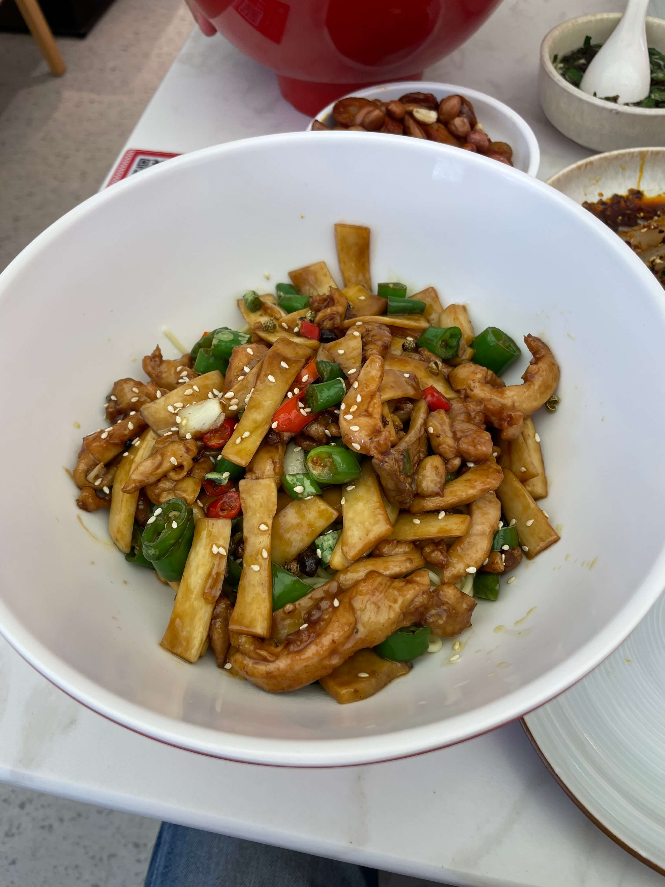
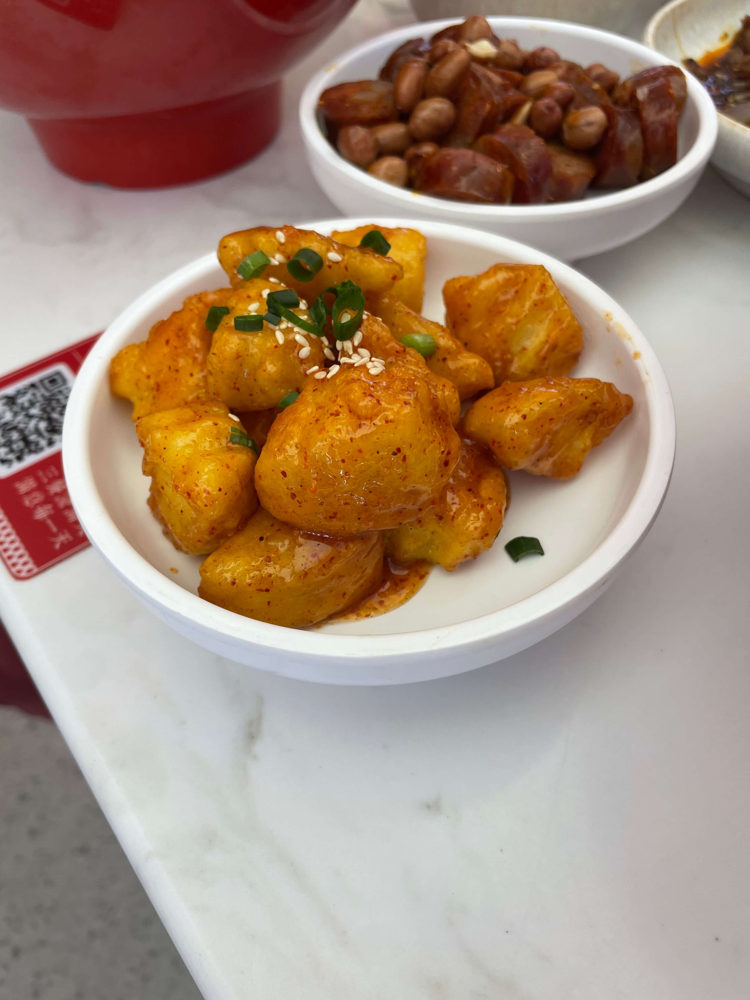
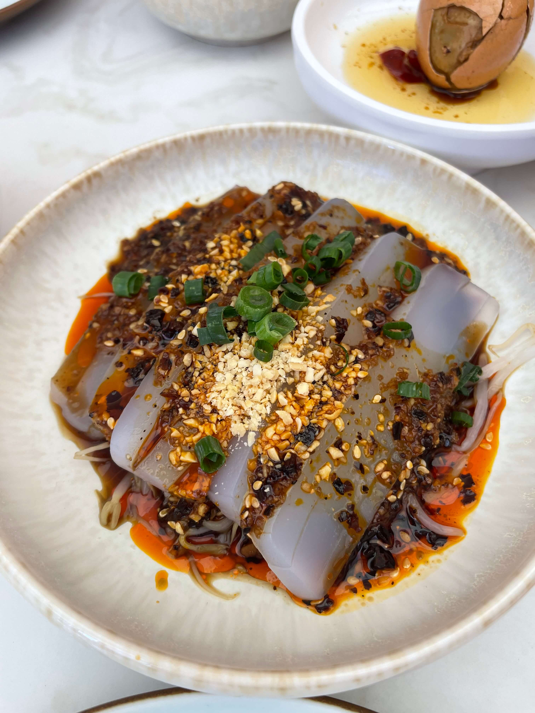
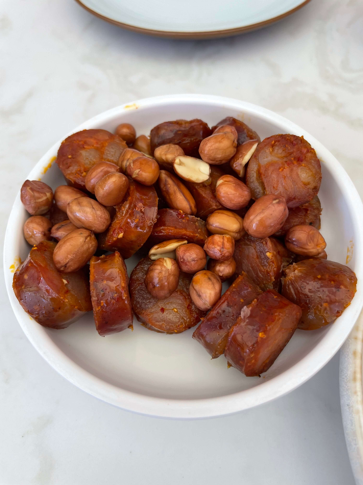

昨天去了苏州桥附近的渝满天现炒浇头重庆面馆，两人共消费90余元。

<!-- truncate -->

花椒鸡面辣椒放得不少，但整体不算特别辣。杏鲍菇给得很多，几乎比鸡肉还多；面条本身口感中规中矩，整体不如大悦城的福和面馆。这家是常规水煮面，而福和面馆更偏上海风格，汤底带一点酱油色，风味路线不太一样。

肝腰合炒面能吃出一些内脏味，处理得不算特别干净，但也算中规中矩。有些饭馆会把内脏处理得更干净，几乎吃不出异味，口感也更好。

干拌土豆整体偏甜，刚出锅时有些烫，口感有点类似拔丝，外皮略微焦脆。

川北凉粉还可以，属于稳妥不踩雷的一道。

四川香肠是香肠形状、腊肉风味。我个人不太喜欢，主要是偏油腻，干辣但香气不足。配的花生口感也一般，不够酥脆。

饭馆整体还可以，川味菜偏多，几乎都带辣。面条可以免费续，米饭3元不限量。除了面食，还有一些炒菜，据说工作日生意也挺火。我们这次是周末去的，所以人相对少一些。免费饮料是酸梅汁，口感不错，甜度不高。面馆环境也还可以。

总结一下：

- 适合人群：爱吃辣的小伙伴
- 人均：30～40元（我们这次两人90余元，点得相对多一些）
- 推荐指数：3.5/5
