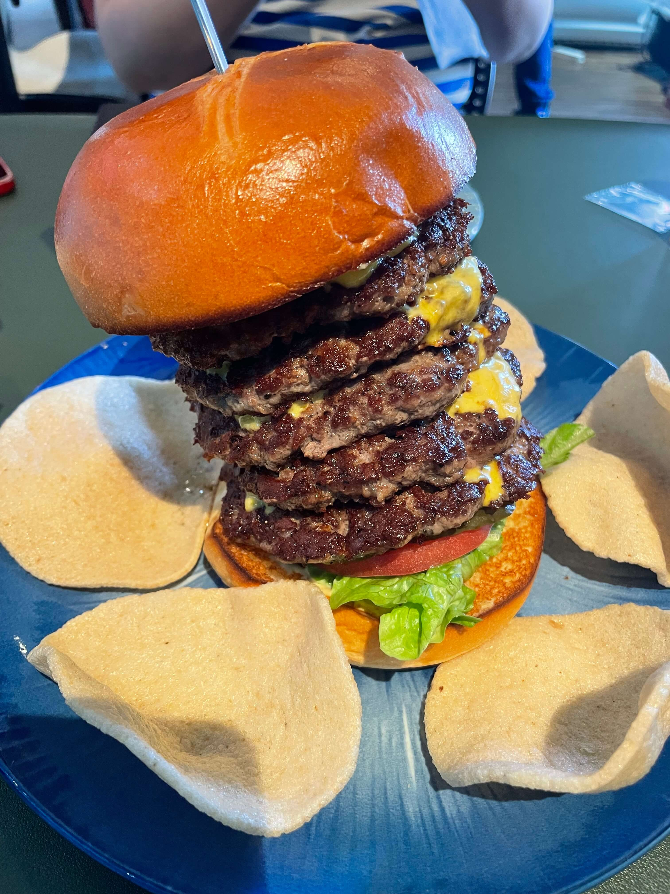
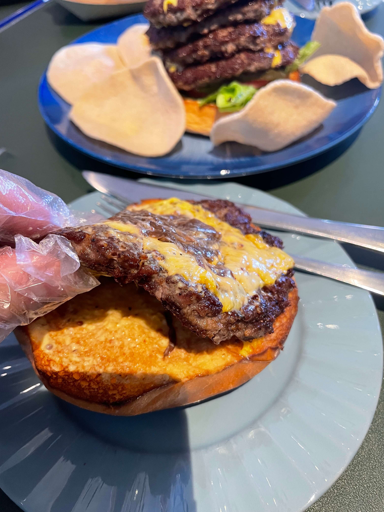

今天中午去了雍和宫、北新桥、簋街附近的排厰 STEAK FACTORY，一家主打大分量和视觉冲击的汉堡店。

<!-- truncate -->

位置在东雍文化园内最里面的二层。东雍文化园本身不大，被一圈民宅包裹，过去需要穿梭不少小胡同，第一次来建议直接导航。排厰就在文化园最里面，从大门一直往里走到头，左手侧就是。

可以从露天楼梯上楼，也可以从一层办公楼进入。如果走办公楼，进门后左手侧有楼梯，不过被透明玻璃挡着，要稍微留意一下。上到二楼后一直往最右侧走，推开玻璃门就到了。店本身开在办公楼中间的走廊里，一侧是玻璃隔断，另一侧是门帘。

整体来说，这家店的位置非常隐蔽，第一次来大概率要找一会儿。我一开始没想走露天楼梯，主要是看着有点锈迹斑斑；改从办公区进去的话，又得再找楼梯和门店位置。

由于在胡同里，而且文化园比较小，不推荐开车。

它的就餐区域比较小。走廊里大概有 4-5 桌，后厨旁边还有 3-4 桌，露天楼梯上来的外侧区域估计也有 5 桌左右。不过桌与桌之间距离都比较近。

店员会主动推荐用美团等平台团购。服务整体还可以，偶尔会有点爱答不理的感觉，但上餐速度和基本态度都还行。

这次点了巨人塔汉堡套餐：一个五层牛肉汉堡，配炸虾片和一听可乐，大致 135 元。

我一开始还以为虾片是额外送的，后来才发现本来就在套餐里，最后基本没怎么吃。

这么大的汉堡，吃法基本只有两种：要么直接用刀切着吃，要么先单独吃掉几层肉，再把它当普通汉堡解决。

牛肉味道不错，每层牛肉上都带着芝士。顶部还撒了一些细丝状配料，不过我没吃出来具体是什么。

最底下的酸黄瓜酸味比较重，里面还有点像泡椒笋里那种小米辣，辣度也比较明显，好在放得不算多。蔬菜本身还算新鲜，但这一层整体风味对我来说偏酸偏辣，口感上没有麦当劳那种更大众化、也更顺口。

面包口感不错，松软且不干，可以吸收一些牛肉和酱料汁水。

除此之外，店里还有双层、三层牛肉汉堡，以及 3.5 斤大牛肋排之类的大分量产品。

整体来说，这家更像是一家适合打卡的大分量汉堡店：味道本身不差，亮点主要在夸张的造型和扎实的分量，环境和找店难度则稍微劝退一些。

总结一下：

- 适合人群：喜欢大分量汉堡、想打卡夸张造型餐品的人
- 人均：70 元起（巨人塔套餐约 135 元）
- 推荐指数：4/5
