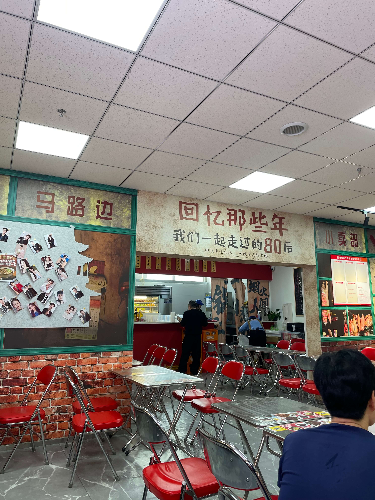
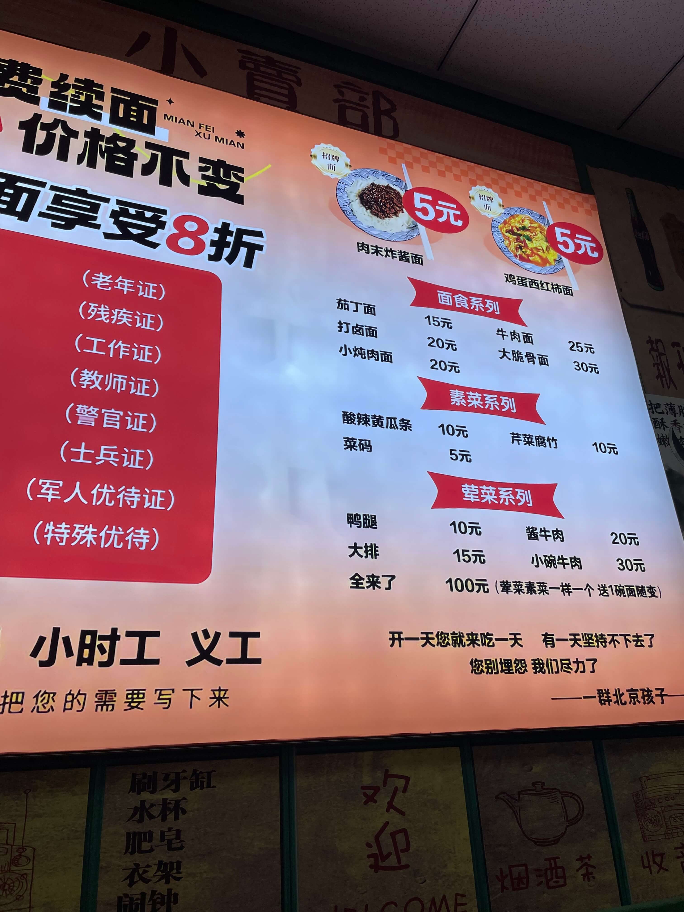
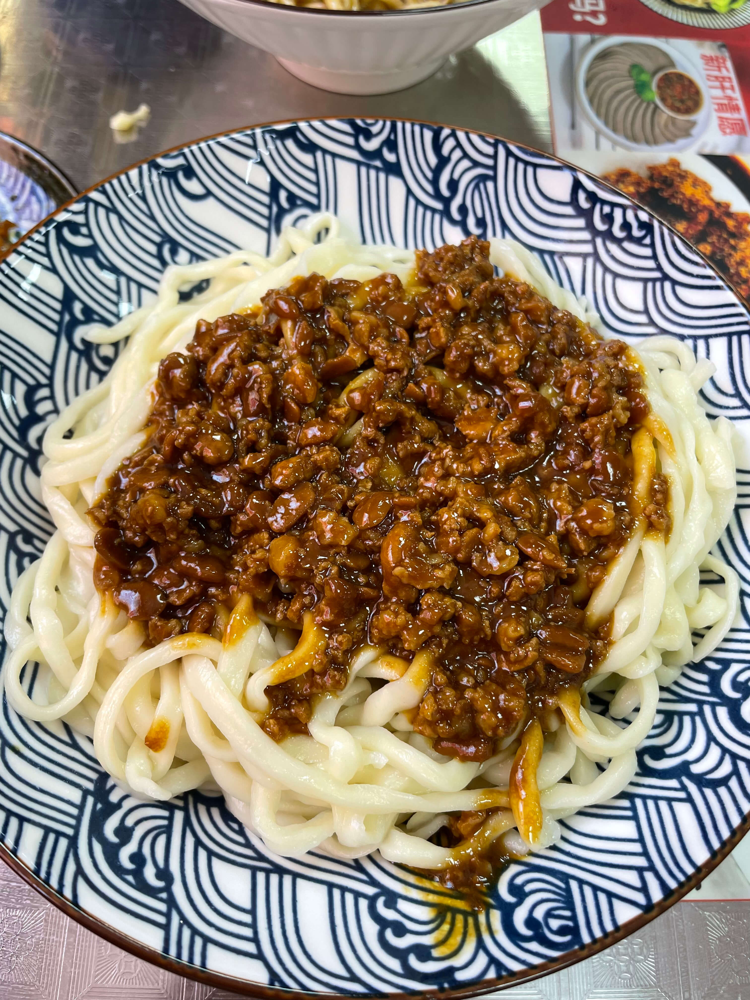
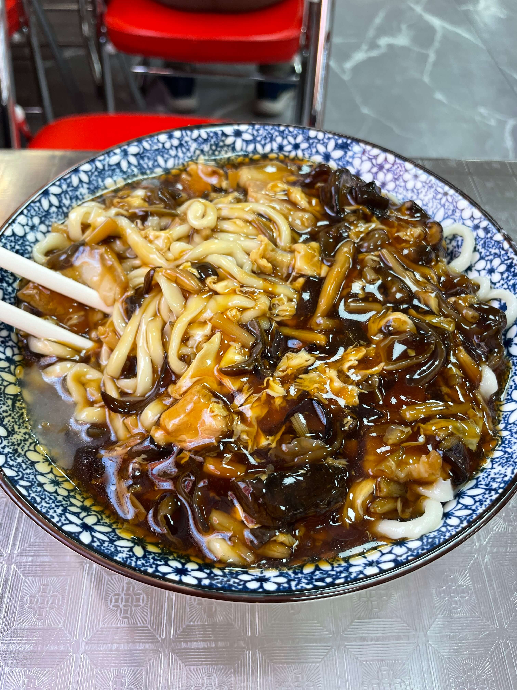
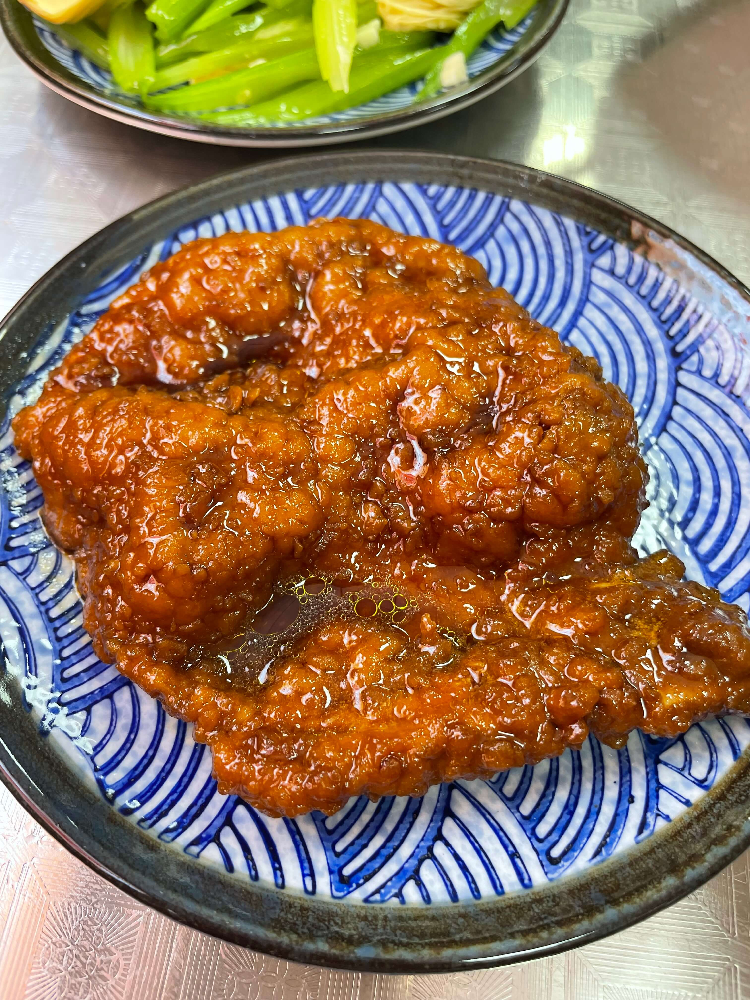
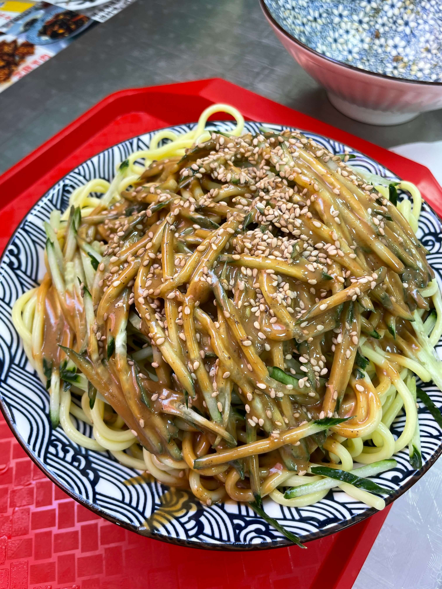

今天中午去了德外大街美廉美超市旁边的面善面馆。我也是刷到 UP 主探店后才知道这里。店里主打的是价格很低的炸酱面、鸡蛋西红柿面，整体走的是“便宜、管饱、家常”的路线，看起来也确实比较照顾附近的打工人、环卫工人和周边居民。

<!-- truncate -->

我原本以为超市和面馆都在地下一层，结果进了美廉美所在的大楼后，走着走着就看到了。店内装修比我预想中干净一些，墙上还贴着不少老北京风格的画面，整体有点怀旧小馆子的感觉。

桌子是老式折叠桌，座椅是那种红皮折叠椅，坐进去之后氛围一下子就出来了。

门口贴着价格表，不过内容并不全。

点餐方式有两种：扫码下单，或者直接到柜台人工点。无论哪种方式，最后都需要自己去取餐。我们是下午一点多去的，店里大概只有 3～4 桌，服务员会直接喊我去拿；如果高峰期人多，估计就得自己盯着窗口排队了。

还是更推荐扫码点餐，因为电子菜单明显更完整，哪些菜没了也会直接显示不能下单，不容易白问一圈。唯一的问题是店里联通信号不太好，扫码加载得有点慢，可能要多试几次。

我和媳妇本来是冲着炸酱面、鸡蛋西红柿面来的，结果鸡蛋西红柿面已经售罄。我一开始问的是一位负责收餐具的店员，对方是不愿意说话还是怎样，反正我是听不见她说了什么。

后来我注意到店门口和招牌上也写着长期招兼职、义工、志愿者之类的信息，所以这位收餐具的店员可能本身就不是专门负责前台接待的。相对来说，后面去柜台点餐时，服务倒是正常不少，沟通也更顺畅一些。

最后我们两个点了：

* 炸酱面，5元x2
* 打卤面，20元
* 凉面，20元
* 猪大排，15元
* 芹菜腐竹，10元
* （共计：75元）

这里面大部分面条基本都是我吃的，媳妇主要吃了打卤面。正常来吃的话，其实人均 20～30 元就差不多能吃得比较舒服，我们这次算是点得偏多。另外店里面条是可以免费续的，所以如果单纯想吃饱，这家的吸引力确实还挺直接。

先说最关心的 5 元炸酱面。这个价格确实很有吸引力，点的时候记得和店员说一声“过水”，口感会更好一些。

严格来说，我觉得它更接近“肉酱面”，而不是那种特别讲究的老北京炸酱面。便宜款的面量明显没有其他贵一些的面条多，酱也相对少一点，不过考虑到价格，这也完全能理解。味道本身还可以，至少不是那种一吃就敷衍的水平，能吃出一点炸酱面的意思。面条是手擀面的路子，至于是不是现做不好说，但口感确实还行，算是这家让我觉得最稳的一部分。

我第一碗一开始顾着吃没拍，后来觉得味道还行，就又补点了一碗，第二碗才留下这张照片。

打卤面我媳妇觉得还可以，但我自己尝着总觉得有一点说不上来的怪味，也没太吃出来到底是哪种调料带出来的。也有可能是我前面连续吃了两碗炸酱面，味觉已经有点混了。

这碗打卤面的料给得不算少，木耳挺多，也有几片肥瘦相间的大肉，我们这碗里甚至还能直接看到一颗八角。只是整体风味还是偏普通，卤子的层次感一般，和家里自己做那种“配料更杂、更厚一点”的打卤面相比，差距还是比较明显。面条和炸酱面是同一款，口感倒是保持得还不错。

墙上还写着“北京孩子过生必吃打卤面”。我自己小时候倒没觉得这是绝对标配，印象里反而炸酱面出现得更多一些。

猪大排有点出乎我的预期。我原本以为会是炸制的，结果上来以后发现更像卤出来的，而且里面还带着一块骨头。整体稍微有点甜，味道只能算凑合，不算难吃，但也没有什么记忆点。我个人感觉这道在整家店里不算特别有代表性。

凉拌芹菜腐竹忘记拍照了。口感其实还不错，就是盐味偏重，我这种重口味还能接受；如果口味清淡一点，可能更适合把它当成小咸菜配着吃。

凉面是这次最不推荐的一样。端上来的时候，应该是店长或者经理跟我聊了两句，说这个凉面里带一点芥末，风格有点像新川面馆，而且还说他们家的更好吃。

不过我实际吃下来，感受和这番介绍差得有点远。因为放了一小会儿才吃，面条已经有点发软了，完全没有那种凉面该有的筋道感；调味也挂不太住，吃起来比较散，芥末味更是淡到几乎察觉不到。和我平时吃过的其他凉面相比，整体完成度差不少。

我后面确实没怎么继续吃，一方面是前面已经吃了两碗多面条，另一方面也是这份凉面的口感实在劝退。不确定这是当天状态问题，还是它本来就是这个水准，但至少按这次表现来看，我之后不会再点。

整体来说，面善面馆更像是一家“解决一顿饭”的社区面馆，而不是需要专门跑来打卡的品质面馆。它最大的优势很明确：有几款价格特别低的基础面，面条本身也不算差，而且还能免费续；但如果往上点到 15 元、20 元档，性价比就没有最开始看起来那么突出了。

如果只是路过、住得近，或者预算比较紧，想找个地方踏实吃碗面，这里是能来的；但如果是专门为了“北京面食体验”或者冲着高完成度来，那我觉得期待值还是要放低一点。

> 开一天你就过来吃一天 有一天坚持不下去了
>
> 您别埋怨 我们尽力了
>
> 北京孩子

总结一下：

- 适合人群：附近上班族、周边居民、预算有限想吃碗便宜面的人
- 不适合人群：专门来打卡、对卤子和整体品质期待较高的人
- 推荐点单：5 元炸酱面可以试试，打卤面看个人口味
- 服务体验：收餐具店员沟通感受一般，但柜台点餐服务还不错
- 避雷提示：凉面这次表现比较差，谨慎点
- 人均：20～30 元（我们两人共 75 元，点得偏多）
- 推荐指数：3/5
