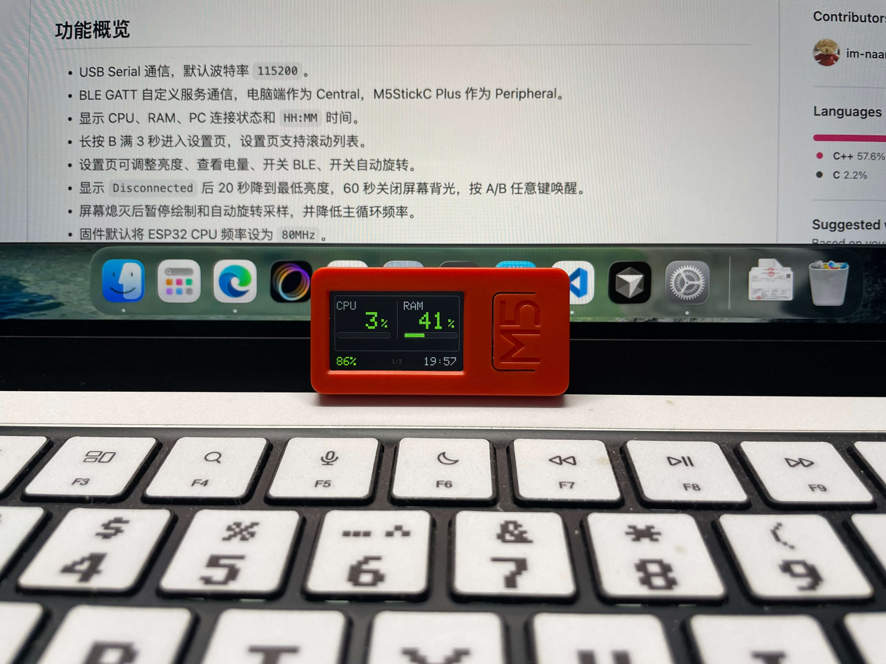

我当时看到 Claude Code 可以用 M5StickC 做审批，还能显示小动物，脑子一热就直接下单了。结果买回来才发现，这东西并不是拿来就能用：需要 Claude Desktop，而且还得是付费用户。我走第三方中转站也不行，蓝牙连接模式根本开不起来，于是这条路就先放下了。

<!-- truncate -->

不过它毕竟是我第一个带屏幕的封装单片机设备，直接吃灰也有点可惜。于是我换了个思路，干脆认真利用一下，借着 AI 做了一个固件和配套工具：[im-naaran/m5stickc-plus-pc-monitor](https://github.com/im-naaran/m5stickc-plus-pc-monitor)。现在已经迭代了好几轮，后面应该还会继续加功能。

这个项目现在大概就是一个电脑状态监控小屏：通过 USB 串口或者 BLE GATT 和电脑通信，显示 CPU、内存、连接状态、本地时间，还能下发自定义页面。按键也不是摆设，A 键短按、双击都可以回传不同操作码，B 键还能切页，长按 B 进设置页，改亮度、BLE 开关和自动旋转。

它不是什么大而全的系统，但确实已经能稳定干活了。对我来说，这种设备最有意思的地方就在这里。

## 效果

这里后面准备放几张实际显示效果图，主要是 CPU、内存、连接状态这类页面。小屏幕本身不大，但信息密度还可以，放在桌面上随手看一眼挺方便。

## 先说硬件

M5StickC Plus 整体做得还不错，手感很好，红色外观也耐看，拿在手里比照片里更顺眼一点。

不过它也确实没有那么强。它的主控平台不算新，性能比不上 S3 那一代。问题是，硬件短板也很明显：

* 没有麦克风
* 没有喇叭，只有蜂鸣器
* 没有红外接收，只有发送

所以很多点子一开始看着挺好，最后都会卡在“它做不了”这一步。这个设备更适合做小屏幕、小交互、小状态显示的东西，不太适合拿来想象成一个什么都能干的小主机。

## 为什么我还是留着它

最初我是冲着 Claude 那套玩法买的，结果实际门槛比想象里高，路也没打通。按理说这时候就该把它放回盒子里，但我又觉得可惜。

因为它是我第一个真正认真折腾的、带屏幕的单片机设备。这个起点还挺重要的。拿它做一个自己真的会用的小工具，比硬追一个不一定能跑通的官方玩法更实在。

AI 写这种项目也挺合适，需求不算大，但细节很多。屏幕怎么显示，按键怎么交互，通信怎么走，状态怎么刷新，都是一些零碎但很磨人的事情。写着写着，反而把它盘活了。

## 价格和选择

按我当时看到的价格，M5StickC Plus 官方淘宝大概是 139 元，加 10 元运费。网上也不算多了。京东上 StickC 大概 230 元，S3 大概 260 元。

我的感觉是：

* M5StickC Plus：手感好，外观顺眼，适合做小玩具
* M5Stick S3：配置更强，整体更值得买

本着买新不买旧的思路，如果能在 200 元左右买到 S3，我会觉得更划算。M5StickC Plus 不是不能买，只是现在再看，它更像一个小而有趣的选择，而不是最优解。

## 小结

M5StickC Plus 不算强，但挺有意思。它不适合承载太大的想法，但很适合做一些轻量、桌面旁边、随手能看一眼的小项目。

如果你要的是一个屏幕设备、一个小状态机、一个简单交互终端，它还挺合适。  
如果你更看重通用能力，或者准备后面继续扩展玩法，我会更偏向直接看 S3。

对我来说，这次买它没有变成“Claude 小动物终端”，但变成了一个能继续迭代的小工具，这就已经不亏了。

> 本文由 Codex / GPT-5.5 辅助整理。我提供主要经历、观点和项目背景，AI 负责生成初稿和调整结构，最后再人工检查修改。
