6 月 26 日去了军嫂手工水饺自助。最近一直忙于加班，拖到今天才终于抽出时间记录一下。

<!-- truncate -->

这家店开在小区内，位置稍微有点绕。第一次去的话还是建议直接导航，进去以后也要多留意一下招牌。

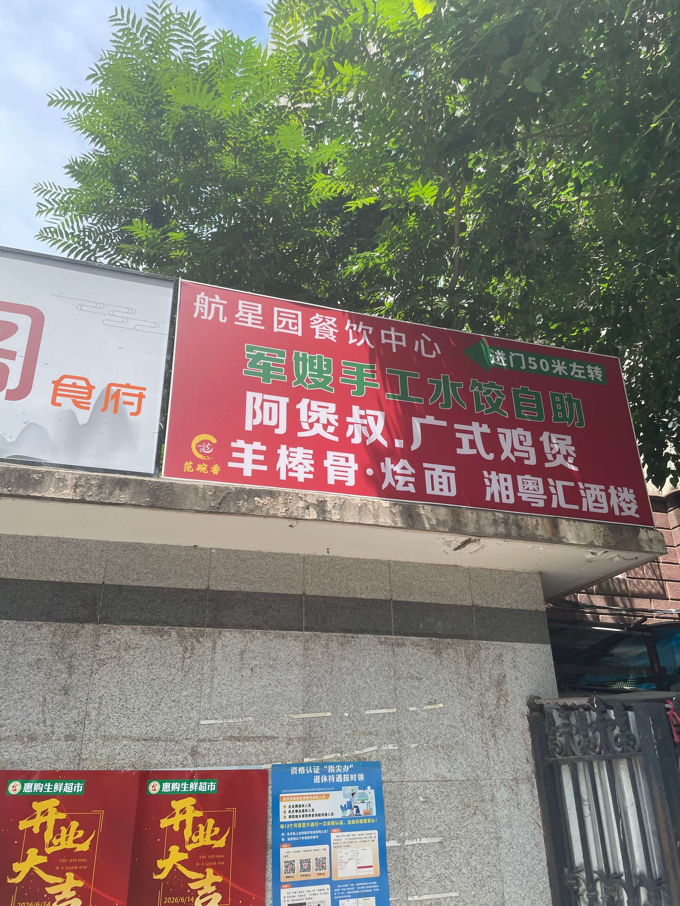

我这次买的是团购券，大概 39 元一位。到店后前台扫码验券，还需要缴纳 10 元押金，店员会给一张小票。离店时凭小票退押金。

自助内容包括炒菜、肉菜、凉菜、小吃，还有十几种水饺，我估计大概有 16 种左右。免费饮料是酸梅汤和橙汁。

饮料这块比较一般。橙汁糖精味道比较重，酸梅汤口味偏清淡，算是能喝。如果比较在意饮料，最好还是自己带一瓶。

我本来就是想来尝尝饺子，所以其他菜品只是每样稍微拿了一点点。

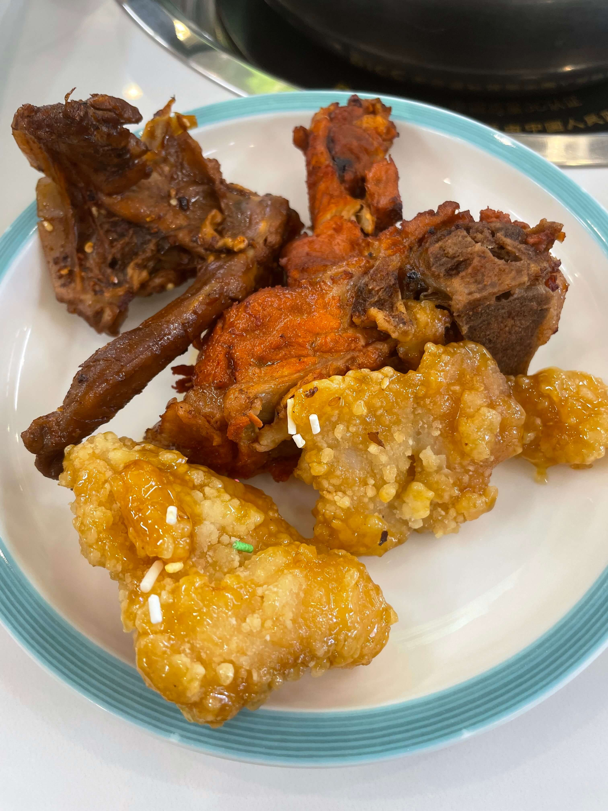

鸭锁骨还行，虽然不及绝味鸭脖那种口感和味道，但也能吃，只是感觉油水少了一点。锅包肉还算不错。炖腔骨我本身不是特别喜欢，尤其是肉卡在骨头缝中间那种吃起来比较费劲，所以只是尝了尝，挑了点比较容易吃到的部位，整体算一般。

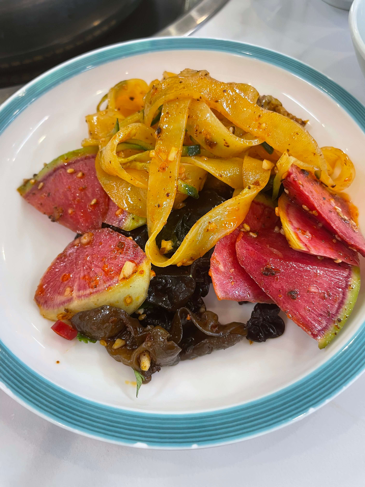

凉菜整体不如热菜。萝卜皮块比较大，不够爽脆；木耳口感太一般，感觉不太好；凉皮也不太好吃。

我之前看美团介绍里还有口水鸡、炸鸡排、小龙虾、凉拌猪肝、爆炒花蛤、肉皮冻、果仁菠菜，这些我其实都想尝尝，但现场没怎么看到。我估计大部分当天没有上，也可能有个别是我自己没注意到。另外还有水果，我这次没有尝试。

饺子放在两个冷藏柜里，每个柜子大概有 6～8 种馅料的饺子。靠里面的主要是 4 个饺子一盘，靠外侧的主要是 6 个饺子一盘，口味应该是相同的。

两人桌、四人桌都是一个锅。锅不小，肯定够用，火力也很大。只是两人桌比较局促，我一个人坐两人桌，也只是勉强够摆。

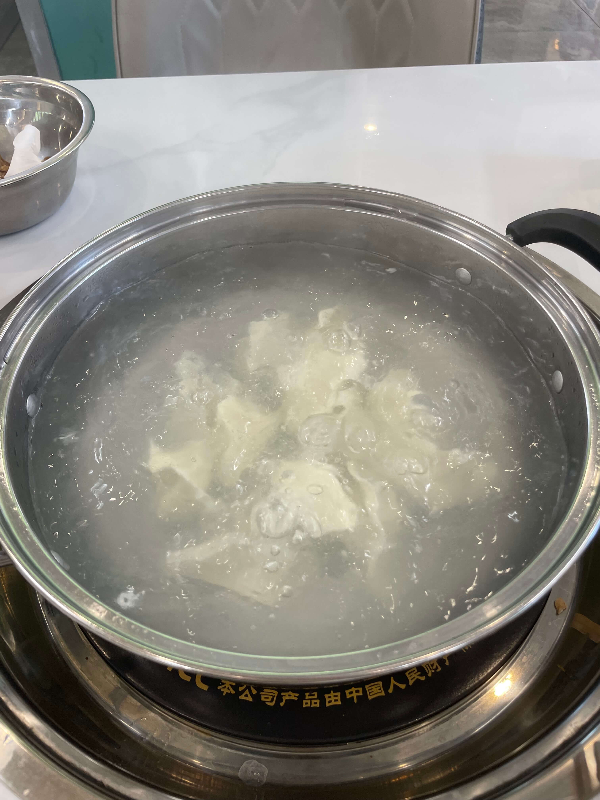

煮完饺子后有专用盘子，下面可以漏水，放饺子比较方便。

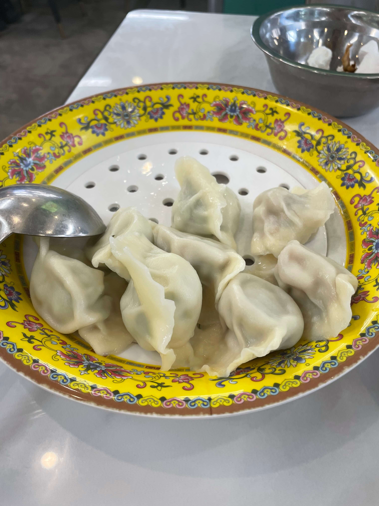

我这次一共吃了 6 份，共计 36 个饺子。

先说鲅鱼韭菜饺子。第一感觉是一般，还行。但后面吃了好几种以后，反而觉得鲅鱼韭菜算不错的。它口感适中，有淡淡的鱼味，配菜味道也没有压得太重。

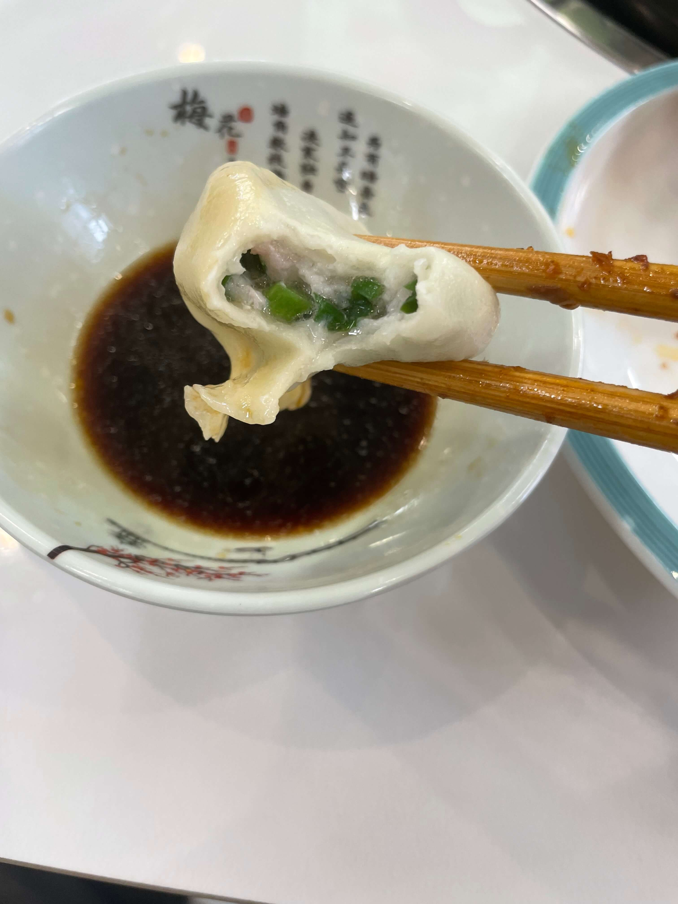

三鲜饺子不错。虾仁不小，虽然我不太喜欢吃虾仁类饺子，但这个虾仁大小确实有点震惊到我了。自助里能吃到接近手指粗细的虾仁，属实不容易。三鲜饺子整体口感也不错，应该是这次吃到的里面最好的。

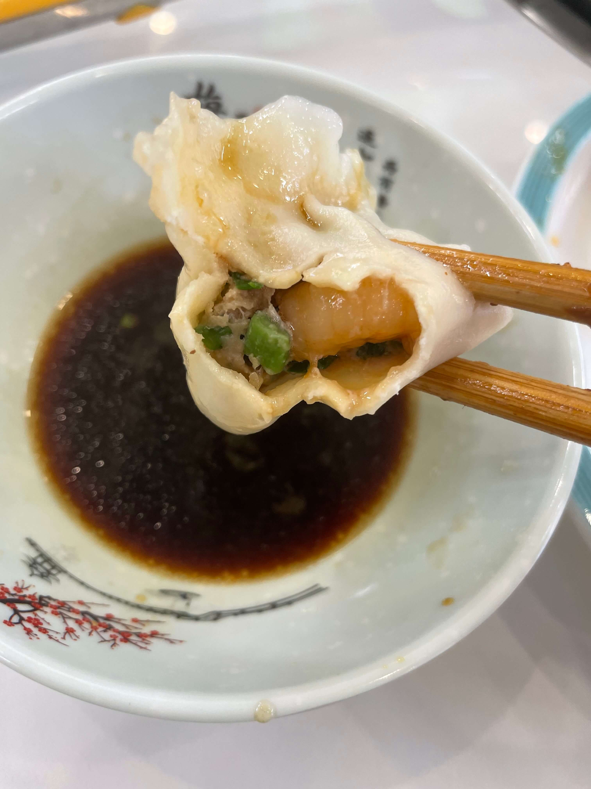

牛肉大葱饺子我感觉一般。我本身不太爱吃牛肉馅，所以主观上就没有太加分。它肉味比较重，不太香，而且肉显得有点干柴，吃几个就不太想继续吃了。

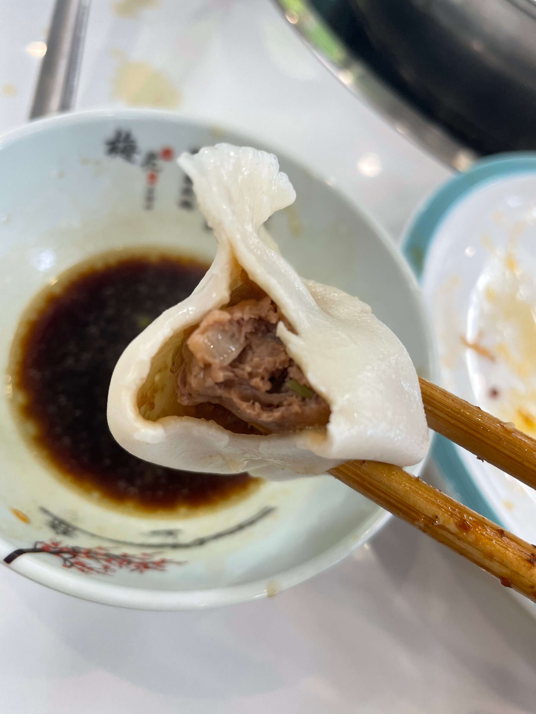

还有羊肉馅饺子，但我对羊肉馅比较抵制，所以没有尝试。

芹菜鲜肉饺子一般般，可以吃，搭配还行。主要也是我平时很少吃芹菜馅，所以没有太多特别感受。

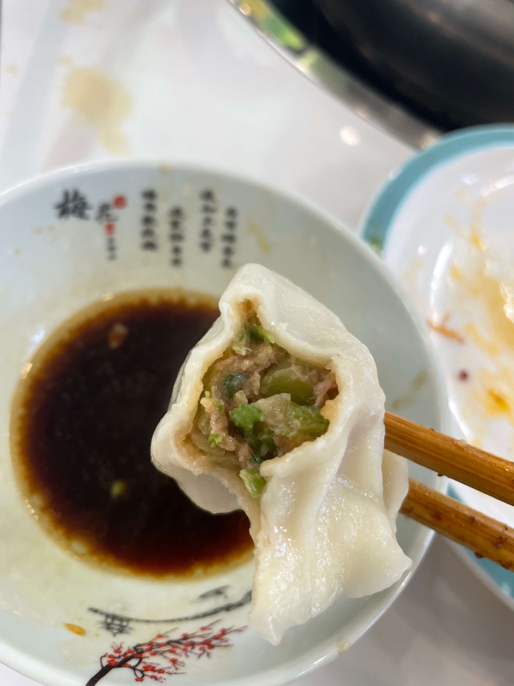

猪肉茴香饺子不太推荐。我自己其实很习惯茴香饺子，但这家的馅料配比感觉不太对。一般茴香饺子要么肉多茴香少，要么肉和茴香差不多一比一；它这个像是菜的种类比较多，不知道又加了什么菜，总之味道不太对。

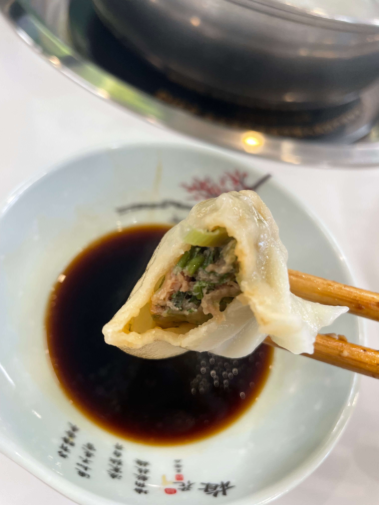

鲜肉韭菜饺子是最后吃的，当时已经比较饱了，所以印象也没有特别突出。整体感觉一般，没有什么明显特色。

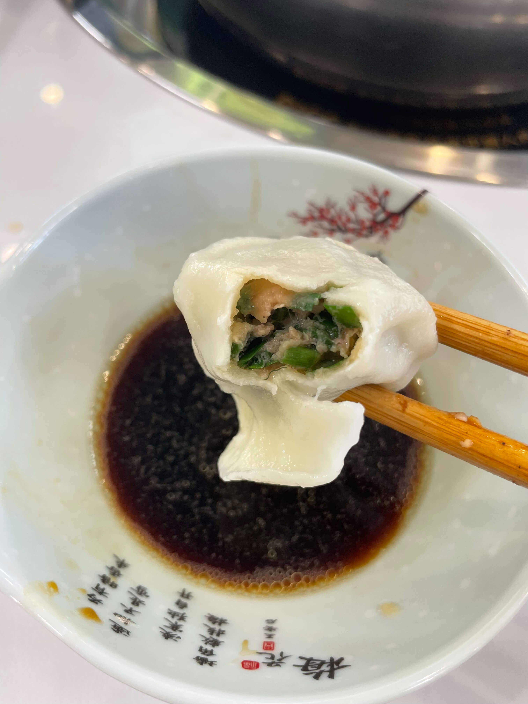

总的来说，如果就是想吃饺子，可以优先拿三鲜和鲅鱼韭菜。其他口味建议按自己平时爱吃的馅去试试看。人多的话比较好分着尝，人少就没那么方便，可以先拿 4 个装的小份试试。

39 元这个价位不算贵，饺子里也有能打的，还有不少热菜、凉菜，只是整体品质没有特别高。我这次去的时候是周五中午，11 点半人还不算多，12 点开始基本上就快坐满了。

如果当天菜品多一些，感觉会比较划算。但按我这次体验来说，整体只能算一般：饺子吃到了不少种类，但我想吃的那些菜品基本没看见什么。

总结一下：

- 适合人群：想吃饺子自助、对环境和菜品品质要求不高的人
- 推荐饺子：三鲜、鲅鱼韭菜
- 不太推荐：猪肉茴香
- 饮料建议：酸梅汤能喝，橙汁不太推荐；介意的话可以自带饮料
- 人均：39 元左右，另需现场缴纳 10 元押金，离店凭小票退还
- 推荐指数：3/5
